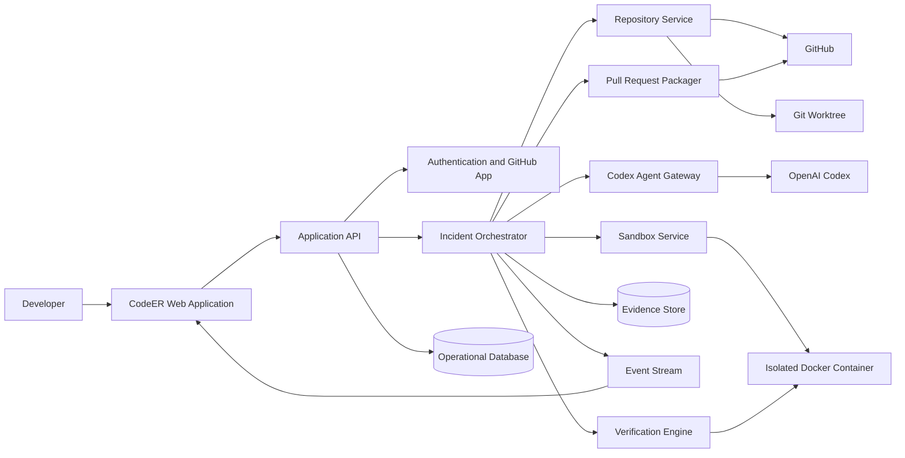
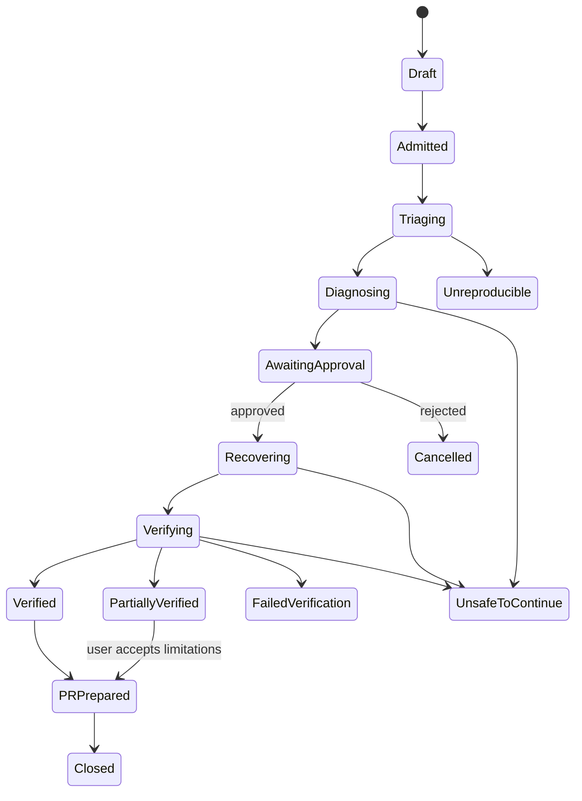
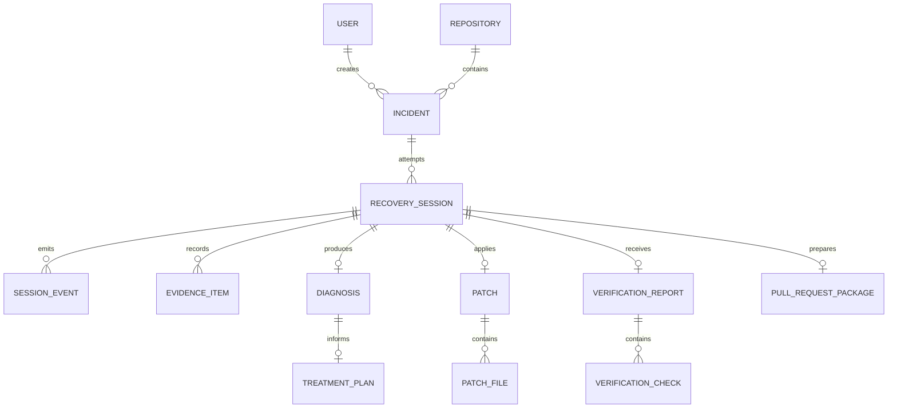

# CodeER System Architecture

**Version:** 1.0  
**Scope:** Build Week MVP with extensible production boundaries

---

## 1. Architecture objective

CodeER must convert an unstructured repository failure into a controlled, auditable recovery workflow. The architecture prioritises isolation, evidence, deterministic state transitions and independent verification over maximum autonomy.

The system is designed as a modular monolith for the hackathon, with clear service boundaries that can later be extracted without changing the domain model.

---

## 2. High-level architecture



---

## 3. Recommended repository structure

```text
apps/
├── web/                  Next.js product interface
├── api/                  NestJS HTTP and event API
└── worker/               Background workflow execution
packages/
├── domain/               Entities, state machines and policies
├── database/             Prisma schema and repositories
├── github/               GitHub App and provider adapter
├── codex/                Codex gateway and prompt contracts
├── sandbox/              Docker execution adapter
├── verification/         Check planning and result evaluation
├── events/               Typed event contracts
├── ui/                   Shared product components
├── config/               Environment validation
└── observability/        Logging, metrics and tracing
infra/
├── docker/
├── github/
└── scripts/
docs/
```

A pnpm workspace is recommended for deterministic package management and shared TypeScript contracts.

---

## 4. Core components

### Web application

Responsibilities:

- authentication entry;
- repository connection;
- incident creation;
- evidence and timeline display;
- treatment-plan approval;
- diff review;
- verification report;
- pull-request preview;
- case history.

The web client must consume typed API contracts and receive workflow events through Server-Sent Events for the MVP. WebSockets may be introduced later if bidirectional streaming becomes necessary.

### Application API

Responsibilities:

- validate user input;
- authorise repository access;
- expose read models;
- create commands for the orchestrator;
- issue short-lived event-stream tokens;
- enforce idempotency.

The API must not execute repository commands directly.

### Incident orchestrator

The orchestrator is the workflow authority.

Responsibilities:

- enforce state transitions;
- dispatch agent jobs;
- create and destroy isolation resources;
- persist evidence references;
- manage approval gates;
- retry safe operations;
- stop unsafe sessions;
- calculate session confidence;
- trigger pull-request packaging.

The orchestrator should be implemented as an explicit state machine rather than a collection of loosely connected callbacks.

### Repository service

Responsibilities:

- clone or fetch repository;
- resolve branch and commit;
- validate repository size and supported ecosystem;
- create worktree;
- generate recovery branch name;
- calculate diffs;
- create commits;
- clean up worktree;
- interact with GitHub through a provider adapter.

Suggested branch pattern:

```text
codeer/recovery/<incident-id>-<short-slug>
```

### Sandbox service

Responsibilities:

- create isolated container;
- mount only the recovery worktree;
- inject approved non-secret configuration;
- restrict network and capabilities;
- enforce CPU, memory, disk and time limits;
- stream stdout and stderr;
- terminate and clean up reliably.

Suggested default constraints:

- non-root user;
- read-only base filesystem where practical;
- writable mounted worktree and temporary directory only;
- no Docker socket;
- no host network;
- command timeout;
- maximum output size;
- secret redaction before persistence.

### Codex agent gateway

Responsibilities:

- translate domain tasks into constrained Codex requests;
- provide only relevant repository context;
- expose approved tools;
- validate structured outputs;
- track model request identifiers and token usage;
- reject malformed or policy-violating responses.

Codex is used for repository understanding, diagnosis, plan generation, patching, test generation and review. Workflow authority remains in CodeER.

### Verification engine

Responsibilities:

- derive checks from repository metadata and treatment plan;
- run checks in a fresh verification context;
- compare original and post-repair failure evidence;
- detect unexpected files;
- aggregate results;
- determine verified, partial, failed or blocked status.

The verification engine must not trust the repair agent's statement that the fix works.

### Evidence store

Stores immutable references to:

- logs;
- commands;
- exit codes;
- file excerpts;
- repository maps;
- diagnoses;
- treatment plans;
- diffs;
- verification results.

Large raw logs may be stored as object artifacts with metadata and hashes in the database.

### Event stream

Publishes typed session events to the user interface.

Example events:

```text
incident.admitted
session.started
sandbox.created
reproduction.started
reproduction.failed
reproduction.succeeded
agent.started
agent.completed
evidence.recorded
diagnosis.completed
plan.awaiting_approval
plan.approved
patch.applied
verification.check_started
verification.check_completed
verification.completed
pull_request.prepared
session.stopped
```

---

## 5. Recovery sequence

```mermaid
sequenceDiagram
    actor Dev as Developer
    participant Web
    participant API
    participant Orch as Orchestrator
    participant Repo as Repository Service
    participant Box as Sandbox
    participant Codex
    participant Ver as Verifier
    participant GH as GitHub

    Dev->>Web: Admit repository incident
    Web->>API: Create incident
    API->>Orch: Start recovery command
    Orch->>Repo: Resolve repository and create worktree
    Repo->>GH: Fetch branch and commit
    Repo-->>Orch: Worktree and base SHA
    Orch->>Box: Create isolated sandbox
    Orch->>Box: Run reproduction command
    Box-->>Orch: Exit code and logs
    Orch->>Codex: Map repository and diagnose with evidence
    Codex-->>Orch: Structured diagnosis
    Orch->>Codex: Produce treatment plan
    Codex-->>Orch: Structured plan
    Orch-->>Web: Await approval
    Dev->>Web: Approve procedure
    Web->>API: Approve plan
    API->>Orch: Continue recovery
    Orch->>Codex: Apply approved repair in worktree
    Codex-->>Orch: Patch and change rationale
    Orch->>Ver: Independently verify exact patch
    Ver->>Box: Run required checks
    Box-->>Ver: Results and logs
    Ver-->>Orch: Verification report
    Orch->>Repo: Commit verified patch
    Orch->>GH: Prepare branch and PR package
    Orch-->>Web: Present reviewable recovery
```

---

## 6. State machine



All transitions must be persisted with actor, timestamp, previous state, new state and reason.

---

## 7. Data model

Recommended primary tables:

- `users`
- `github_installations`
- `repositories`
- `incidents`
- `recovery_sessions`
- `session_events`
- `evidence_items`
- `diagnoses`
- `treatment_plans`
- `treatment_plan_changes`
- `patches`
- `patch_files`
- `verification_reports`
- `verification_checks`
- `pull_request_packages`
- `policy_violations`
- `audit_logs`

### Relationship overview



---

## 8. API surface

Suggested REST endpoints:

```text
POST   /v1/repositories/connect
GET    /v1/repositories
GET    /v1/repositories/:id
POST   /v1/incidents
GET    /v1/incidents
GET    /v1/incidents/:id
POST   /v1/incidents/:id/start
POST   /v1/incidents/:id/cancel
GET    /v1/incidents/:id/events
GET    /v1/sessions/:id
GET    /v1/sessions/:id/evidence
GET    /v1/sessions/:id/diagnosis
GET    /v1/sessions/:id/treatment-plan
POST   /v1/sessions/:id/treatment-plan/approve
POST   /v1/sessions/:id/treatment-plan/revise
POST   /v1/sessions/:id/treatment-plan/reject
GET    /v1/sessions/:id/diff
GET    /v1/sessions/:id/verification
POST   /v1/sessions/:id/pull-request
GET    /v1/cases/:id
```

Write operations should accept an idempotency key.

---

## 9. Structured Codex contracts

Every agent response should conform to a versioned schema.

### Diagnosis output

```json
{
  "schemaVersion": "1.0",
  "rootCause": "string",
  "causalChain": ["string"],
  "evidenceIds": ["ev_123"],
  "affectedFiles": ["package.json"],
  "alternativeHypotheses": [
    {"hypothesis": "string", "rejectedBecause": "string"}
  ],
  "confidence": 0.94,
  "limitations": []
}
```

### Treatment-plan output

```json
{
  "schemaVersion": "1.0",
  "objective": "Restore the production workspace build",
  "changes": [
    {
      "file": "package.json",
      "reason": "Deployment calls a missing script",
      "operation": "add-script"
    }
  ],
  "risk": "low",
  "validationCommands": ["pnpm build:super"],
  "rollback": "Revert the recovery commit"
}
```

Model output must be parsed and validated before workflow progression.

---

## 10. Command execution policy

Commands are classified as:

- `READ_ONLY`: file listing, version checks, test discovery;
- `BUILD`: install, lint, typecheck, test, build;
- `MODIFYING`: formatter, migration generation, package update;
- `DESTRUCTIVE`: database reset, force operations, filesystem deletion;
- `PROHIBITED`: privilege escalation, host access, credential extraction.

The MVP allows read-only and approved build commands. Modifying commands require treatment-plan approval. Destructive commands are disabled in the default policy. Prohibited commands always stop the session.

---

## 11. Security model

### Trust boundaries

1. Browser to API
2. API to worker
3. Worker to GitHub
4. Worker to Codex
5. Worker to sandbox
6. Sandbox to package registries or test dependencies

### Controls

- GitHub App installation tokens are short-lived and never sent to Codex.
- Repository credentials are removed before sandbox execution when not required.
- Secrets are represented as named placeholders.
- Logs pass through redaction filters.
- Each session receives a unique sandbox and worktree.
- Pull requests are prepared only after verification policy passes.
- Audit logs are append-only at the application layer.

### Prompt-injection defence

Repository content is untrusted input. Instructions found in source files, comments, issues or logs must not override system policy. Agent prompts must clearly separate evidence from executable instructions, and tools must enforce policy independently of model text.

---

## 12. Failure handling

### Retryable

- temporary GitHub API errors;
- transient package-registry errors;
- event-stream interruption;
- worker restart before a non-idempotent step begins.

### Non-retryable without user action

- repository permission denied;
- unsupported ecosystem;
- invalid treatment-plan schema;
- policy violation;
- secret exposure;
- sandbox resource limit exceeded repeatedly;
- user rejection.

Every stopped session must expose a human-readable reason and the last durable state.

---

## 13. Observability

Use a correlation chain:

```text
requestId → incidentId → sessionId → agentRunId → commandRunId
```

Structured logs should include:

- event name;
- timestamp;
- actor;
- stage;
- duration;
- outcome;
- repository identifier;
- redaction count;
- error code.

Metrics:

- stage duration;
- sandbox startup time;
- reproduction success rate;
- agent schema-validation failure rate;
- verification pass rate;
- cleanup success rate.

---

## 14. Deployment profile

### Hackathon

```text
Web/API/Worker: one deployable environment
Database: PostgreSQL
Queue: in-process or Redis-backed job queue
Sandbox: local or dedicated Docker host
Artifacts: local volume or S3-compatible storage
Events: Server-Sent Events
```

### Production evolution

- separate API and worker scaling;
- dedicated sandbox runner pool;
- durable queue;
- object storage;
- OpenTelemetry tracing;
- tenant isolation;
- policy service;
- regional data controls.

---

## 15. Architecture acceptance criteria

- No repair command runs on the API host directly.
- No session modifies the default branch.
- Every workflow transition is persisted.
- Every agent output is schema-validated.
- Every displayed claim links to evidence.
- Verification runs against the exact patch being proposed.
- Unexpected changes prevent silent success.
- Session cancellation terminates sandbox work.
- Cleanup is idempotent.
- GitHub credentials and repository secrets are never included in model context.
