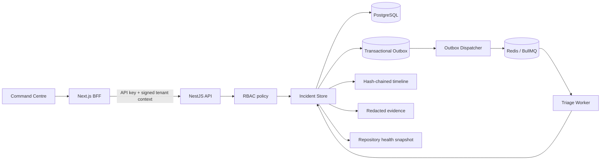
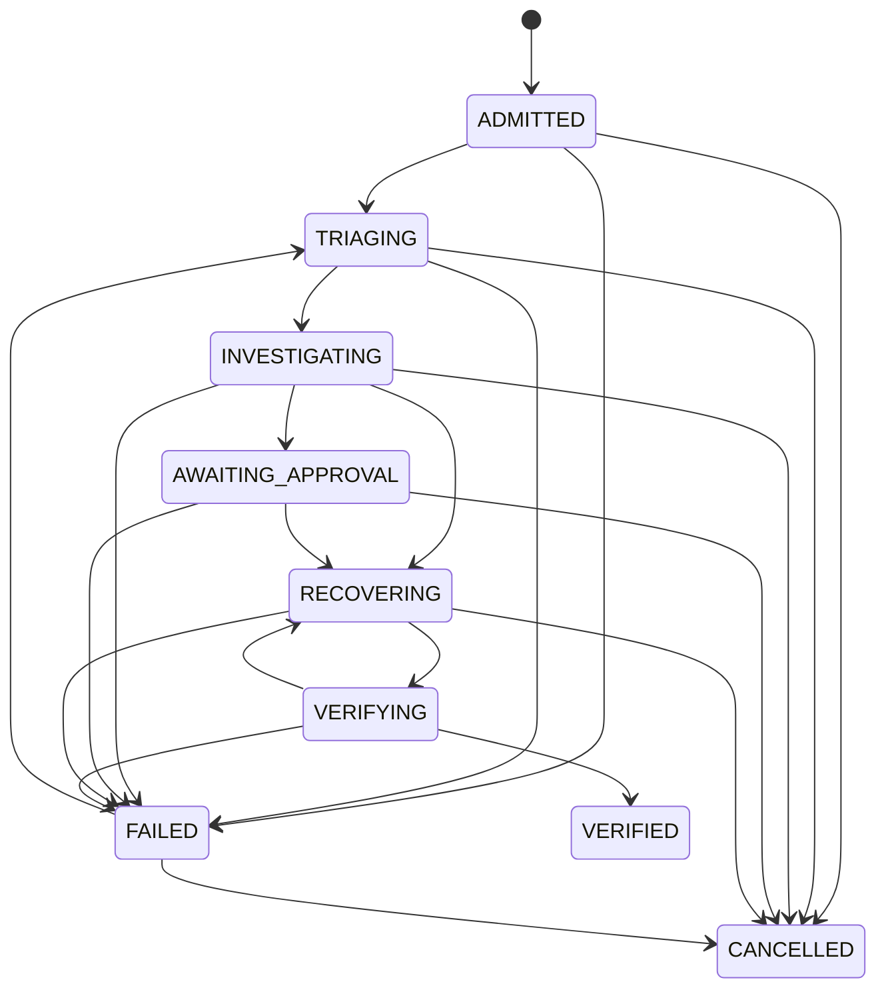
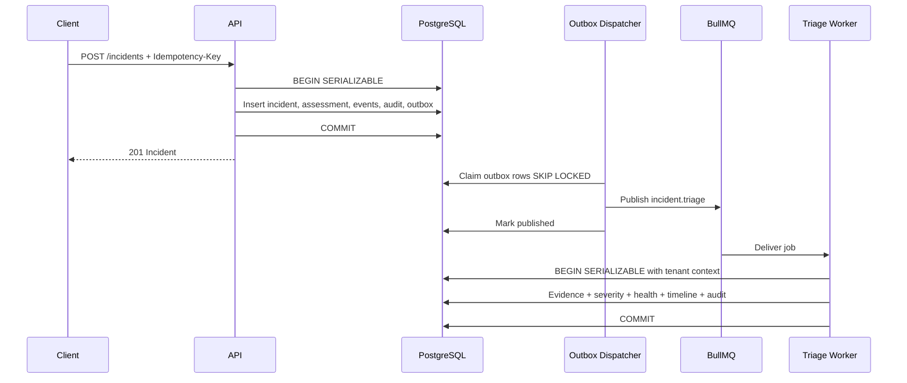

# CodeER Sprint 3 — Enterprise Incident Engine

## Status

**Implementation status:** complete on the Sprint 3 branch pending review, database integration execution in CI and merge.

**Purpose:** establish the incident-management bounded context that every later diagnosis, recovery, verification and pull-request workflow depends on.

This is not a demo-only incident list. The implementation treats an incident as a tenant-owned, versioned, auditable operational record with deterministic severity policy, immutable evidence, asynchronous triage, repository-health calculations and a tamper-evident timeline.

## Product outcome

A permitted user or service can:

1. admit an incident against a repository;
2. attach impact and machine-readable failure signals;
3. receive a deterministic initial severity assessment;
4. queue asynchronous triage through a transactional outbox;
5. collect and redact evidence;
6. calculate repository health;
7. review the ordered incident timeline and verify its hash chain;
8. transition the incident through a constrained lifecycle using optimistic concurrency;
9. retrieve all data through tenant-scoped APIs and a command-centre UI.

## Bounded context

The Incident Engine owns:

- incident identity, lifecycle and version;
- severity assessment policy and overrides;
- incident events and event-chain integrity;
- evidence metadata, redaction, digest and sensitivity;
- repository-health snapshots associated with incidents;
- triage commands and results;
- idempotent write handling;
- incident-related audit events;
- outbox messages required to hand work to asynchronous processors.

It does not own:

- GitHub installation authorization;
- repository cloning and worktree lifecycle;
- sandbox process execution;
- Codex prompts or model routing;
- repair plans;
- patch application;
- verification commands;
- pull-request creation.

Those remain separate bounded contexts and communicate with incidents through typed contracts and durable events.

## Architecture

## Data ownership and tenancy

Every tenant-owned aggregate carries `organizationId` directly or is reachable only through a tenant-owned parent.

Directly scoped tables:

- `Repository`
- `RepositoryIntake`
- `Incident`
- `Evidence`
- `RepositoryHealthSnapshot`
- `AuditLog`
- `IdempotencyRecord`
- `OutboxMessage`

Indirectly scoped tables:

- `RepositoryWorktree` through `Repository`
- `IncidentEvent` through `Incident`
- `SeverityAssessment` through `Incident`
- `RecoverySession` through `Incident`
- `VerificationReport` through `RecoverySession` and `Incident`

Application queries include explicit organization filters. PostgreSQL row-level security adds a second enforcement layer. Each tenant transaction sets the transaction-local `app.current_organization_id`; policies reject rows outside that organization even if an application query accidentally omits a tenant predicate.

The outbox dispatcher uses a transaction-local `app.codeer_worker_bypass=true` flag. This bypass is limited to `OutboxMessage` and is never used for incident, evidence or repository queries.

## Incident aggregate

The incident is the consistency boundary for:

- current status and recovery stage;
- severity and severity score;
- optimistic concurrency version;
- latest activity timestamp;
- acknowledgement and resolution timestamps;
- source and external correlation;
- impact and normalized signals.

The current state is stored in `Incident` for fast command-centre queries. The event timeline is separately append-only and supplies a verifiable operational history. The event timeline is not treated as the only projection source in Sprint 3; this avoids forcing a full event-sourcing operational model before it is needed.

## Lifecycle

All transitions are validated by a domain policy. The API requires `expectedVersion`; the database update repeats the version predicate. Competing writes therefore fail with a conflict instead of silently overwriting each other.

## Severity model

Policy: `codeer-severity-v1`.

The score combines:

- availability impact;
- affected users;
- revenue impact;
- data-integrity impact;
- security impact;
- environment criticality;
- recurrence;
- explicit signals such as security exposure, production unavailability, broken authentication and deployment blockage;
- workaround availability.

Classification:

|  Score | Severity |
| -----: | -------- |
| 85–100 | SEV-1    |
|  65–84 | SEV-2    |
|  35–64 | SEV-3    |
|   0–34 | SEV-4    |

A manual override never erases the calculated severity. The persisted assessment records both values, the policy version, factors, override flag and rationale. Overrides require a documented reason and an actor with `incident:severity:override`.

## Evidence model

Evidence is normalized before persistence:

1. runtime schema validation;
2. maximum inline payload of 256 KiB;
3. recursive secret-key and token-shaped value redaction;
4. canonical JSON serialization;
5. SHA-256 digest calculation;
6. duplicate detection by incident, digest and kind;
7. sensitivity assignment;
8. append-only storage after collection.

Evidence payloads larger than 256 KiB must later be stored in encrypted object storage, with the database retaining an object reference, digest and metadata. Sprint 3 intentionally prevents large logs from being written into PostgreSQL JSONB.

## Tamper-evident timeline

Every incident event contains:

- monotonically increasing sequence number;
- event type;
- canonical payload;
- actor type and actor identifier;
- request, correlation and causation identifiers;
- occurrence timestamp;
- previous event hash;
- current event hash.

The hash covers all security-relevant event metadata. Database triggers reject event updates and deletes. The API recomputes the full chain whenever it returns incident detail and exposes the integrity result to the command centre.

This detects accidental or unauthorized mutation. It does not replace external immutable storage or cryptographic signing by a KMS-held key. Enterprise deployment should periodically anchor chain heads in a separate write-once audit system.

## Asynchronous triage

Incident creation and triage-request persistence occur in the same serializable transaction as an outbox message. The API does not publish directly to Redis.

Outbox properties:

- unique deduplication key;
- partition key by incident;
- `FOR UPDATE SKIP LOCKED` claiming;
- processing lease and stale-lock recovery;
- exponential retry delay;
- bounded attempts;
- dead-letter state;
- idempotent queue job identifiers.

## Repository health

Policy: `codeer-health-v1`.

Dimensions:

- build;
- tests;
- deployment readiness;
- dependencies;
- security;
- API consistency;
- frontend functionality.

The weighted score is stored as an immutable snapshot rather than updating a mutable health column. This supports trend analysis, policy versioning and future recalculation.

## API consistency and idempotency

Write requests are validated with Zod contracts shared across API, worker and BFF.

Incident creation supports `Idempotency-Key`:

- key is scoped by organization and operation;
- request body is canonicalized and hashed;
- repeating the same request returns the original result;
- reusing a key with a different request fails with conflict;
- expired records can be replaced;
- production configuration requires idempotency keys.

## Identity and authorization boundary

The browser never calls the internal API directly. The Next.js BFF signs an identity context containing:

- HTTP method and full path;
- request and correlation identifiers;
- organization ID;
- actor ID and type;
- normalized role list;
- timestamp.

The API verifies an HMAC-SHA256 signature with constant-time comparison and rejects stale contexts. Production startup fails unless tenant context, signed context, API authentication and idempotency enforcement are enabled.

Roles:

- Organization Owner
- Organization Admin
- Incident Commander
- Responder
- Viewer
- Service

Permissions are operation-specific. Responders can create incidents and evidence but cannot transition lifecycle state or override severity. Restricted evidence and severity overrides require elevated permission.

The API-key transport is transitional service authentication. User identity must later come from OIDC and be translated into the same signed context by the BFF or an identity-aware gateway.

## Concurrency and consistency

- Serializable transactions protect incident creation, evidence insertion, state transitions and triage.
- Serialization failures and deadlocks are retried within a bounded budget.
- Statement and lock timeouts limit resource consumption.
- Optimistic version checks protect human-driven state changes.
- Repeatable-read incident detail prevents mixed timeline, evidence and snapshot views.
- Advisory locks serialize organization audit-chain appends.

## Scaling model

### API

The API is stateless and horizontally scalable. Request identity is carried in signed headers. Data consistency is in PostgreSQL, not process memory.

### Workers

Triage workers scale horizontally through BullMQ concurrency. Incident jobs use stable job IDs and the database remains authoritative. Worker concurrency is configurable independently from repository-intake concurrency.

### Database

Initial production profile:

- managed PostgreSQL with multi-AZ availability;
- PgBouncer or managed pooling in transaction mode;
- read replicas for history/reporting only;
- partition `IncidentEvent`, `AuditLog` and `RepositoryHealthSnapshot` by time when volume requires it;
- archive expired evidence to encrypted object storage;
- maintain indexes by organization and recency.

### Redis

Redis is a delivery and coordination system, not the system of record. Loss of Redis may delay work but must not lose incident intent because the outbox remains in PostgreSQL.

## Reliability targets

Initial enterprise targets:

| Capability                      |                                     Target |
| ------------------------------- | -----------------------------------------: |
| Incident create API p95         |                 < 300 ms excluding network |
| Incident list API p95           |                    < 250 ms for 25 records |
| Triage dispatch lag p95         |                                < 5 seconds |
| Timeline integrity verification |                       100% on detail reads |
| Accepted write durability       |       PostgreSQL committed before response |
| Lost triage requests            | 0 under single-region recoverable failures |
| Cross-tenant data exposure      |                                0 tolerated |

## Failure behavior

- PostgreSQL unavailable: readiness fails and writes fail closed.
- Redis unavailable: incidents remain committed; outbox retries until Redis returns.
- Worker crash: BullMQ re-delivers or the outbox republishes based on durable state.
- Duplicate delivery: evidence digests, outbox keys and queue IDs prevent duplicate logical effects.
- Stale human update: optimistic-concurrency conflict.
- invalid tenant signature: 401 before domain work.
- insufficient role: 403 with structured security log.
- corrupted timeline: detail response marks integrity failure; downstream recovery must stop.

## Exit criteria

Sprint 3 is complete when:

- database migration applies to a clean PostgreSQL database;
- RLS prevents cross-tenant access;
- incident create/list/detail APIs pass unit and integration checks;
- triage is published through the outbox and processed by a worker;
- evidence is redacted and digest-verified;
- timeline hash verification succeeds and detects mutation;
- health snapshots are persisted;
- RBAC and signed context checks pass;
- command-centre screens display live incident data;
- CI validates build, tests, migration and an end-to-end database smoke journey.
