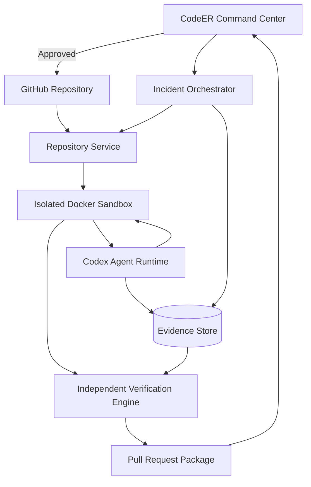

# CodeER Recovery Workflow Architecture

## Objective

Deliver one reliable end-to-end recovery workflow that converts a reproducible repository failure into a verified, reviewable pull-request package.

## Core workflow

```text
Connect repository
      ↓
Select or describe incident
      ↓
Create isolated environment
      ↓
Reproduce failure
      ↓
Map relevant repository context
      ↓
Generate evidence-backed diagnosis
      ↓
Prepare treatment plan
      ↓
Request human approval
      ↓
Apply controlled patch
      ↓
Run independent verification
      ↓
Prepare pull-request package
```

## System architecture



## Core components

### Command Center

Responsibilities:

- Connect repositories
- Create and monitor incidents
- Display evidence and agent activity
- Review treatment plans and diffs
- Approve or reject procedures
- Review verification results
- Prepare pull requests

### Repository Service

Responsibilities:

- Clone the selected repository
- Resolve the target branch or commit
- Read repository metadata
- Create a dedicated worktree or branch
- Calculate changed files
- Generate patch artifacts
- Prevent direct writes to protected branches

### Sandbox Service

Responsibilities:

- Create an isolated Docker environment
- Install dependencies
- execute approved commands
- Stream stdout and stderr
- Enforce resource and time limits
- Remove the environment after completion

Required controls:

- Network restrictions where practical
- Command allowlist or policy checks
- CPU, memory, and disk limits
- Secret redaction
- Process timeout
- Workspace cleanup

### Incident Orchestrator

Responsibilities:

- Manage recovery state
- Dispatch specialized agents
- Save evidence and artifacts
- Track confidence and uncertainty
- Pause for human approval
- Handle retries and failures
- Stop unsafe operations
- Preserve the audit trail

Suggested states:

```text
CREATED
ADMITTED
TRIAGING
DIAGNOSING
PLAN_READY
AWAITING_APPROVAL
RECOVERING
VERIFYING
STABILIZED
FAILED
CANCELLED
```

### Codex Response Team

#### Triage Agent

Determines severity, scope, impact, and initial investigation plan.

#### Repository Mapper

Maps applications, packages, routes, services, scripts, environment variables, tests, and CI/CD workflows.

#### Root Cause Investigator

Reproduces the failure, tests hypotheses, and links the diagnosis to evidence.

#### Repair Agent

Produces the smallest safe patch and explains every changed file.

#### Security Reviewer

Checks for exposed secrets, unsafe commands, privilege expansion, vulnerable dependencies, and risky configuration changes.

#### Verification Agent

Runs the required checks independently from the Repair Agent.

#### Release Agent

Builds the final pull-request summary, verification evidence, limitations, and rollback instructions.

### Evidence Store

Persist:

- Original incident description
- Logs and failing commands
- Repository map
- Relevant files and commits
- Agent hypotheses
- Root-cause evidence
- Treatment plan
- User approvals
- Patch and changed files
- Verification results
- Pull-request package

## Evidence-driven diagnosis

Every diagnosis should contain:

```json
{
  "summary": "Production build invokes a missing workspace script",
  "confidence": 0.94,
  "evidence": [
    {
      "type": "command_output",
      "command": "pnpm build:super",
      "result": "Missing script: build:super"
    },
    {
      "type": "file_reference",
      "path": "apps/chat-app/package.json",
      "finding": "No build:super script is defined"
    }
  ],
  "affectedFiles": ["package.json", "apps/chat-app/package.json", "vercel.json"]
}
```

## Treatment plan contract

```json
{
  "rootCause": "string",
  "proposedChanges": [
    {
      "path": "string",
      "reason": "string",
      "risk": "low | medium | high"
    }
  ],
  "validationCommands": ["string"],
  "rollbackPlan": "string",
  "requiresApproval": true
}
```

## Verification contract

```json
{
  "status": "verified | failed | partial",
  "originalFailureResolved": true,
  "buildPassed": true,
  "testsPassed": true,
  "typecheckPassed": true,
  "criticalJourneyPassed": true,
  "unexpectedChanges": [],
  "confidence": 0.94
}
```

## Verification policy

A recovery may be marked **Stabilized** only when:

1. The original failure is no longer reproducible.
2. Required builds and tests pass.
3. The patch contains no unexplained files.
4. Security checks do not identify a blocking risk.
5. The final report includes known limitations.
6. The user can review the exact changes.

The system must use **Partial** when some checks cannot run. It must not convert missing evidence into a passing result.

## Pull-request package

The Release Agent prepares:

```markdown
## Incident

## Root cause

## Recovery procedure

## Changed files

## Verification

## Risk and limitations

## Rollback

## CodeER evidence
```

## MVP technology boundaries

The first release supports:

- GitHub
- React or Next.js
- Node.js backends
- npm or pnpm
- Docker sandboxing
- Git worktrees or branches
- Codex-powered investigation and repair
- GitHub pull-request preparation

## Deferred capabilities

- Automatic production rollback
- Automatic merging
- Every programming language
- Multi-cloud deployments
- Continuous monitoring
- Organization billing
- Full vulnerability-management platform
- Unsandboxed shell access

## Safety invariants

- Never push directly to `main`.
- Never expose raw repository secrets.
- Never mark an unexecuted check as passed.
- Never allow the Repair Agent to approve its own patch.
- Never hide changed files from the user.
- Never merge without explicit user authorization.
