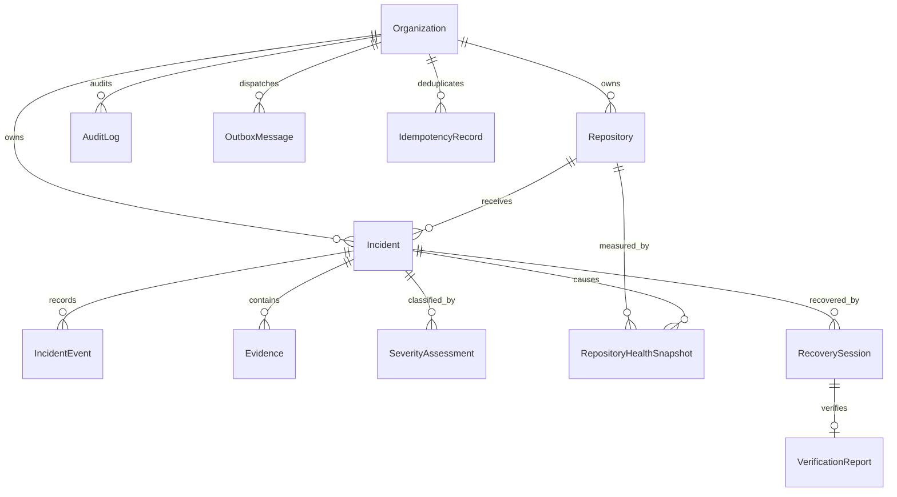

# Incident Data Model

## Relationship overview



## Aggregate rules

- `Incident.version` increases for every logical aggregate mutation.
- status changes require allowed transition and expected version.
- events are ordered uniquely by `(incidentId, sequence)`.
- evidence is unique by `(incidentId, digest, kind)`.
- health is append-only snapshots, not an overwritten score.
- severity assessments are append-only policy decisions.
- outbox deduplication key is globally unique.
- idempotency key is unique by organization and scope.

## Data classes

| Entity             | Classification        | Mutation model                   | Retention baseline                     |
| ------------------ | --------------------- | -------------------------------- | -------------------------------------- |
| Incident           | Internal/confidential | versioned                        | contract + legal requirement           |
| IncidentEvent      | Confidential          | append-only                      | at least incident retention            |
| Evidence           | variable              | insert-only, delete on retention | sensitivity policy                     |
| SeverityAssessment | Internal              | append-only                      | incident retention                     |
| HealthSnapshot     | Internal              | append-only                      | trend window then archive              |
| AuditLog           | Restricted            | append-only                      | security/compliance policy             |
| OutboxMessage      | Internal              | state transitions                | short operational window after publish |
| IdempotencyRecord  | Internal              | replace after expiry             | TTL                                    |

## Index strategy

Hot operational access is organization-first and recency-first. Primary incident list index:

```text
(organizationId, status, severity, lastActivityAt DESC)
```

High-volume future changes:

- monthly partition `IncidentEvent` by `occurredAt`;
- monthly partition `AuditLog` by `createdAt`;
- time partition `RepositoryHealthSnapshot`;
- partial index on pending/failed outbox rows;
- archive published outbox messages;
- separate object storage for large evidence.

## Row-level security

Transactions set:

```sql
SELECT set_config('app.current_organization_id', '<organization-uuid>', true);
```

Forced RLS policies validate direct organization columns or parent ownership. The outbox dispatcher uses a separate transaction-local bypass flag limited to the outbox policy.
