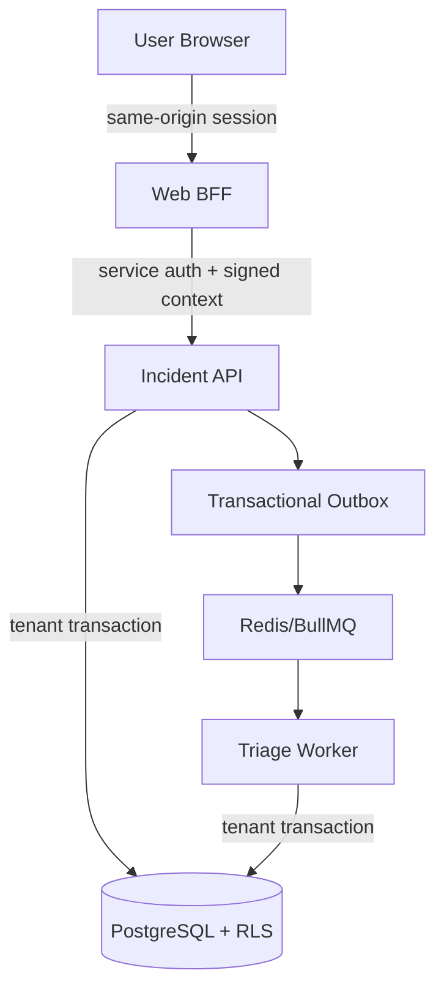

# Incident Data Security Standard

## Scope

This standard governs incident records, timelines, evidence, severity assessments, repository-health snapshots, audit records and triage messages.

## Security objectives

1. No organization can read or modify another organization's incident data.
2. No browser receives internal API credentials or signing secrets.
3. Every write is attributable to an actor, request and correlation chain.
4. Evidence is redacted before persistence.
5. Incident and audit history cannot be silently rewritten.
6. Asynchronous delivery cannot cause unbounded duplicate effects.
7. Services fail closed when production security configuration is incomplete.

## Trust boundaries

The repository and every piece of evidence are untrusted inputs. Log text, filenames, URLs and agent output must never be interpreted as trusted commands.

## Identity context

Production requests require:

- bearer service authentication;
- explicit organization UUID;
- actor identifier and actor type;
- actor roles;
- request and correlation IDs;
- timestamp;
- HMAC signature.

The signature binds identity to HTTP method and path, preventing a signed read context from being replayed as a write to another route. The timestamp limits replay duration. Context secrets must be generated with at least 256 bits of entropy and stored in a managed secret service.

## Authorization matrix

| Operation               | Owner/Admin | Commander | Responder | Viewer | Service |
| ----------------------- | :---------: | :-------: | :-------: | :----: | :-----: |
| Read incidents          |      ✓      |     ✓     |     ✓     |   ✓    |    ✓    |
| Create incident         |      ✓      |     ✓     |     ✓     |   —    |    ✓    |
| Add standard evidence   |      ✓      |     ✓     |     ✓     |   —    |    ✓    |
| Add restricted evidence |      ✓      |     ✓     |     —     |   —    |    ✓    |
| Request triage          |      ✓      |     ✓     |     ✓     |   —    |    ✓    |
| Transition lifecycle    |      ✓      |     ✓     |     —     |   —    |    ✓    |
| Override severity       |      ✓      |     ✓     |     —     |   —    |    ✓    |
| Admit repository        |      ✓      |     —     |     —     |   —    |    ✓    |

Authorization denials are emitted as structured security logs with tenant, actor, role, request and permission context. A future centralized audit sink must ingest those logs immutably.

## Tenant isolation

Defense in depth:

1. signed organization context;
2. RBAC check in application service;
3. explicit `organizationId` query predicates;
4. transaction-local PostgreSQL tenant setting;
5. forced PostgreSQL row-level-security policies;
6. tenant identifiers in queue jobs and outbox messages;
7. organization check before returning Redis-backed intake jobs.

A test environment must include negative cross-tenant test cases before private customer onboarding.

### Database identities

CodeER separates schema administration from application traffic. Migration automation uses an administrative connection, while API and worker processes use a dedicated `NOSUPERUSER`, `NOCREATEDB`, `NOCREATEROLE`, `NOINHERIT`, `NOBYPASSRLS` runtime role. The administrative URL is not mounted into runtime services.

Row-level security protects against accidental cross-tenant access by application queries. It is not a substitute for protecting database credentials: a compromised runtime service can still set custom session variables. Production deployments therefore require network isolation, short-lived credentials where supported, database activity monitoring and no direct human use of the runtime role.

## Evidence controls

### Classification

- Public — safe for public submission.
- Internal — normal engineering information.
- Confidential — redacted secrets or sensitive operational details.
- Restricted — regulated, customer-sensitive or security investigation material.

### Ingestion

- validate metadata and size;
- redact secret-like keys and token patterns;
- canonicalize JSON;
- calculate SHA-256 digest;
- enforce duplicate key by incident, digest and kind;
- persist sensitivity, origin and observed time;
- append an evidence event to the incident chain.

### Storage

Sprint 3 stores bounded inline evidence in PostgreSQL. Production evolution must add:

- envelope encryption with tenant-specific data-encryption keys;
- encrypted object storage for large payloads;
- KMS-backed key rotation;
- malware scanning for uploaded artifacts;
- retention and legal-hold policy;
- access logs for every restricted evidence read;
- customer-managed key option for regulated deployments.

## Integrity

Incident events are SHA-256 hash chained and protected by update/delete triggers. Audit logs use a separate organization-level hash chain and an advisory lock to serialize chain creation.

Hash chains detect mutation; they do not prove who performed the original write. Future enterprise hardening should periodically sign chain heads using a KMS asymmetric key and export them to immutable storage.

Evidence rows reject updates. Expired evidence may be deleted only by a dedicated retention principal after recording a retention audit event.

## Database controls

- forced RLS on tenant-owned tables;
- parameterized SQL only;
- bounded connection pool;
- transaction-local statement and lock timeouts;
- serializable transactions for aggregate writes;
- repeatable-read incident detail;
- deadlock and serialization retry budget;
- database credentials separated by API, worker, migration and reporting roles in production;
- TLS required for managed database connections;
- point-in-time recovery enabled;
- backups encrypted and restoration tested.

## Queue and outbox controls

- no secret credentials in queue payloads;
- payload schema validation before work;
- durable database intent before publish;
- bounded retry and exponential delay;
- dead-letter state;
- lease timeout for abandoned claims;
- stable deduplication keys;
- service-only worker bypass limited to outbox RLS;
- worker job receives tenant context but cannot select arbitrary tenants.

## Logging

Do log:

- request ID;
- correlation ID;
- tenant ID;
- actor ID/type/roles;
- action and outcome;
- incident ID;
- policy version;
- durations and retry count;
- error class and safe code.

Never log:

- API keys;
- GitHub tokens;
- private keys;
- raw authorization headers;
- unredacted evidence payloads;
- full environment values;
- repository credentials.

## Threats and controls

| Threat                   | Primary controls                                                   |
| ------------------------ | ------------------------------------------------------------------ |
| forged tenant header     | signed context, timestamp, service authentication                  |
| cross-tenant query bug   | explicit predicates, forced RLS                                    |
| privilege escalation     | role-permission policy, signed roles                               |
| replayed write           | signed path/method/timestamp, idempotency keys                     |
| secret leakage in logs   | recursive redaction, bounded summaries                             |
| timeline tampering       | append-only trigger, hash-chain verification                       |
| duplicate queue delivery | outbox key, job ID, evidence digest                                |
| queue loss               | PostgreSQL outbox remains source of intent                         |
| SQL injection            | parameterized queries, no user-built identifiers                   |
| denial of service        | rate limits, body limit, payload size, timeouts, queue concurrency |
| evidence poisoning       | treat content as data, no shell execution in Sprint 3              |

## Production admission gate

Private enterprise repositories remain blocked until all of these are validated:

- OIDC user authentication;
- organization membership synchronization;
- database role separation;
- encrypted evidence object storage;
- KMS key management;
- centralized immutable audit export;
- automated RLS cross-tenant tests;
- restore drill;
- security review and penetration test;
- incident-response process for CodeER itself.
